# QUaServer

This is a [Qt](https://www.qt.io/) based library that provides a C++ **wrapper** for the [open62541](https://open62541.org/) library, and **abstraction** for the OPC UA Server API.

By *abstraction* it is meant that some of flexibility provided by the original *open62541* server API is sacrificed for ease of use. If more flexibility is required than what *QUaServer* provides, it is highly recommended to use the original *open62541* instead.

The main goal of this library is to provide an object-oriented API that allows quick prototyping for OPC UA servers without having to spend much time in creating complex address space structures.

*QUaServer* is still work in progress, test properly and use precaution before using in production. Please report any issues you encounter in this repository providing a minimum working code example that replicates the issue and a thorough description.

```
THE SOFTWARE IS PROVIDED "AS IS", WITHOUT WARRANTY OF ANY KIND, EXPRESS OR IMPLIED, INCLUDING BUT NOT LIMITED TO THE WARRANTIES OF MERCHANTABILITY, FITNESS FOR A PARTICULAR PURPOSE, TITLE AND NON-INFRINGEMENT. IN NO EVENT SHALL THE COPYRIGHT HOLDERS OR ANYONE DISTRIBUTING THE SOFTWARE BE LIABLE FOR ANY DAMAGES OR OTHER LIABILITY, WHETHER IN CONTRACT, TORT OR OTHERWISE, ARISING FROM, OUT OF OR IN CONNECTION WITH THE SOFTWARE OR THE USE OR OTHER DEALINGS IN THE SOFTWARE.
```

To test a *QUaServer* based application it is recommended to use the [UA Expert](https://www.unified-automation.com/downloads/opc-ua-clients.html) OPC UA Client.

---

## Include

This library requires at least `Qt 5.7` or higher and `C++ 11`.

To use *QUaServer*, first a copy of the *open62541* shared library is needed. An amalgamation of the latest compatible *open62541* version is included in this repository for convenience in [./src/amalgamation](./src/amalgamation). 

The amalgamation included in this repository was created using the following *CMake* command:

```bash
cd open62541.git
mkdir build; cd build;
cmake -DUA_ENABLE_AMALGAMATION=ON .. -G "Visual Studio 15 2017 Win64"
```

The `open62541.pro` Qt project can be used to build the included amalgamation into the required shared library using the command:

```bash
cd ./src/amalgamation
# Linux
qmake open62541.pro
make
# Windows
qmake -tp vc open62541.pro
```

If it is desired to use a more recent version of *open62541*, it is possible to build the amalgamation using the soure code in the [open62541 git repository](https://github.com/open62541/open62541) and then replace [./src/amalgamation/open62541.h](./src/amalgamation/open62541.h) and [./src/amalgamation/open62541.c](./src/amalgamation/open62541.c). Though compatibility of *QUaServer* with the latest version of *open62541* is not guaranteed.

Finally to include *QUaServer* in your project, just include [./src/wrapper/quaserver.pri](./src/wrapper/quaserver.pri) into your Qt project file (`*.pro` file). For example:

```cmake
QT += core
QT -= gui

CONFIG += c++11

TARGET = my_project
CONFIG += console
CONFIG -= app_bundle

TEMPLATE = app

INCLUDEPATH += $$PWD/

SOURCES += main.cpp

include($$PWD/../../src/wrapper/quaserver.pri)
```

### Examples

This library comes with examples in the `./examples` folder, which are explained in detail throughout this document. To build the examples:

```bash
cd ./examples
# Linux
qmake -r examples.pro
make
# Windows
qmake -r -tp vc examples.pro
```

---

## Basics

To start using *QUaServer* it is necessary to include the `QUaServer` header as follows:

```c++
#include <QUaServer>
```

To create a server simply create an `QUaServer` instance and call the `start()` method:

```c++
int main(int argc, char *argv[])
{
	QCoreApplication a(argc, argv);

	// create server
	QUaServer server;
	// start server
	server.start();

	return a.exec(); 
}
```

Note it is necessary to create a `QCoreApplication` and execute it, because `QUaServer` makes use of [Qt's event loop](https://wiki.qt.io/Threads_Events_QObjects).

By default the *QUaServer* listens on port **4840** which is the [IANA assigned port](https://www.iana.org/assignments/service-names-port-numbers/service-names-port-numbers.xhtml?search=4840) for OPC UA applications. To change the listening port, simply pass it as the first argument of the *QUaServer* constructor:

```c++
QUaServer server(8080);
```

To start creating OPC *Objects* and *Variables* it is necessary to get the *Objects Folder* of the server and start adding instances to it:

```c++
int main(int argc, char *argv[])
{
	QCoreApplication a(argc, argv);

	QUaServer server;

	// get objects folder
	QUaFolderObject * objsFolder = server.objectsFolder();

	// add some instances to the objects folder
	QUaBaseDataVariable * varBaseData = objsFolder->addBaseDataVariable();
	QUaProperty         * varProp     = objsFolder->addProperty();
	QUaBaseObject       * objBase     = objsFolder->addBaseObject();
	QUaFolderObject     * objFolder   = objsFolder->addFolderObject();

	server.start();

	return a.exec(); 
}
```

Instances must only be added using the *QUaServer* API, by using the following methods:

* `addProperty` : Adds a `QUaProperty` instance. *Properties* are the **leaves** of the Address Space tree and cannot have other children. They are used to charaterise what its parent represents and their value do not change often. For example, an *engineering unit* or a *brand name*.

* `addBaseDataVariable` : Adds a `QUaBaseDataVariable` instance. *BaseDataVariables* are used to hold data which might change often and can have children (*Objects*, *Properties*, other *BaseDataVariables*). An example is the *current value* of a temperature sensor.

* `addBaseObject` : Adds a `QUaBaseObject` instance. `BaseObjects` can have children and are used to organize other *Objects*, *Properties*, *BaseDataVariables*, etc. The purpose of objects is to **model** a real device. For example a temperature sensor which has *engineering unit* and *brand name* as properties and *current value* as a variable.

* `addFolderObject` : Adds a `QUaFolderObject` instance. `FolderObjects` derive from `BaseObjects` and can do the same, but are typically use to organize a collection of objects. The so called **Objects Folder** is a `QUaFolderObject` instance that always exists on the server to serve as a container for all the user instances.

Once connected to the server, the address space should look something like this:

<p align="center">
  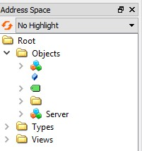
</p>

Note that some instances seen to be added but they have no name. To fix this, the `DisplayName` needs to be set:

```c++
QUaBaseDataVariable * varBaseData = objsFolder->addBaseDataVariable();
varBaseData->setDisplayName("my_variable");
varBaseData->setValue(1);

QUaProperty * varProp = objsFolder->addProperty();
varProp->setDisplayName("my_property");
varProp->setValue("hola");

QUaBaseObject * objBase = objsFolder->addBaseObject();
objBase->setDisplayName("my_object");

QUaFolderObject * objFolder = objsFolder->addFolderObject();
objFolder->setDisplayName("my_folder");
```

For the `varBaseData` and `varProp` instances, also the `Value` is set, which not only defines their intial values but also their `DataType`.

Now the address space should look something like this: 

<p align="center">
  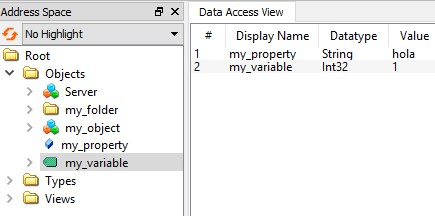
</p>

The `DisplayName`, `Value` and `DataType` are **OPC Attributes**. Depending on the type of the instance (*Properties*, *BaseDataVariables*, etc.) it is possible to set different attributes. All OPC instance types derive from the **Node** type. Similarly, in *QUaServer*, all the types derive directly or indirectly from the C++ `QUaNode` abstract class. 

The *QUaServer* API allows to read and write the instances attributes with the following methods:

### For all Types

The *QUaNode* API provides the following methods to access attributes:

```c++
QString displayName   () const;
void    setDisplayName(const QString &displayName);
QString description   () const;
void    setDescription(const QString &description);
quint32 writeMask     () const;
void    setWriteMask  (const quint32 &writeMask);

QString nodeId        () const;
QString nodeClass     () const;

QString browseName    () const;
void    setBrowseName (const QString &browseName);
```

The `nodeId()` method gives the [string *XML notation* of the OPC NodeId](http://documentation.unified-automation.com/uasdkhp/1.0.0/html/_l2_ua_node_ids.html), which is a unique identifier of the node.

By default the NodeId is assigned automatically by the *open62541* library. It is possible to define a custom NodeId when creating an instance by passing the string *XML notation* as an argument to the respective method. If the NodeId is invalid or already exists, creating the instance will fail returning `nullptr`. For example:

```c++
QUaProperty * varProp = objsFolder->addProperty("ns=1;s=my_prop");
if(!varProp)
{
	qDebug() << "Creating instance failed!";
}
```

### For Variable Types

Both `QUaBaseDataVariable` and `QUaProperty` derive from the abstract C++ class `QUaBaseVariable` which provides the following methods to access attributes:

```c++
QVariant          value() const;
void              setValue(const QVariant &value);
QMetaType::Type   dataType() const;
void              setDataType(const QMetaType::Type &dataType);

qint32            valueRank() const;
QVector<quint32>  arrayDimensions() const; 

quint8            accessLevel() const;
void              setAccessLevel(const quint8 &accessLevel);

double            minimumSamplingInterval() const;
void              setMinimumSamplingInterval(const double &minimumSamplingInterval);

bool              historizing() const;
```

The `setDataType()` can be used to *force* a data type on the variable value. The following [Qt types](https://doc.qt.io/qt-5/qmetatype.html#Type-enum) are supported:

```c++
QMetaType::Bool
QMetaType::Char
QMetaType::SChar
QMetaType::UChar
QMetaType::Short
QMetaType::UShort
QMetaType::Int
QMetaType::UInt
QMetaType::Long
QMetaType::LongLong
QMetaType::ULong
QMetaType::ULongLong
QMetaType::Float
QMetaType::Double
QMetaType::QString
QMetaType::QDateTime
QMetaType::QUuid
QMetaType::QByteArray
```

The `setAccessLevel()` method allows to set a bit mask to define the overall variable read and write access. Nevertheless, the `QUaBaseVariable` API provides a couple of helper methods that allow to define the access more easily without needing to deal with bit masks:

```c++
// Default : read access true
bool readAccess() const;
void setReadAccess(const bool &readAccess);
// Default : write access false
bool writeAccess() const;
void setWriteAccess(const bool &writeAccess);
```

Using such methods we could set a variable to be **writable**, for example:

```c++
QUaBaseDataVariable * varBaseData = objsFolder->addBaseDataVariable();
varBaseData->setWriteAccess(true);
```

When a variable is written from a client, on the server notifications are provided by the `void QUaBaseVariable::valueChanged(const QVariant &value)` Qt signal.

```c++
QObject::connect(varBaseData, &QUaBaseDataVariable::valueChanged, [](const QVariant &value) {
	qDebug() << "New value :" << value;
});
```

### Basics Example

Build and test the basics example in [./examples/01_basics](./examples/01_basics/main.cpp) to learn more.

---

## Methods

In OPC UA, *BaseObjects* instances can have methods. To support this, the *QUaBaseObject* API has the `addMethod()` method which allows to define a name for the method and a callback.

Since the *Objects Folder* is an instance of `QUaBaseObject`, it is possible to add methods to it directly, for example:

```c++
int addNumbers(int x, int y)
{
	return x + y;
}

int main(int argc, char *argv[])
{
	QCoreApplication a(argc, argv);

	QUaServer server;

	QUaFolderObject * objsFolder = server.objectsFolder();

	// add a method using callback function
	objsFolder->addMethod("addNumbers", &addNumbers);

	server.start();

	return a.exec(); 
}
``` 

Which can be remotely executed using a client.

<p align="center">
  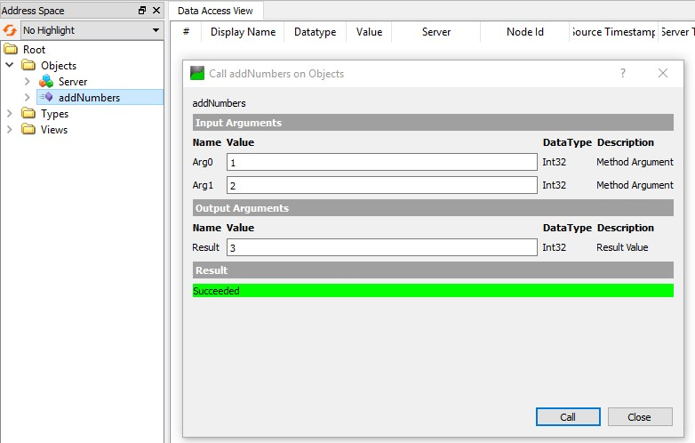
</p>

Note that the *QUaServer* library automatically deduces the arguments and return types. But only the types supported by the `setDataType()` method (see the *Basics* section) are supported by the `addMethod()` API.

A more *flexible* way of adding methods is by using **C++ Lambdas**:

```c++
objsFolder->addMethod("increaseNumber", [](double input) {
	double increment = 0.1;
	return input + increment;
});
```

<p align="center">
  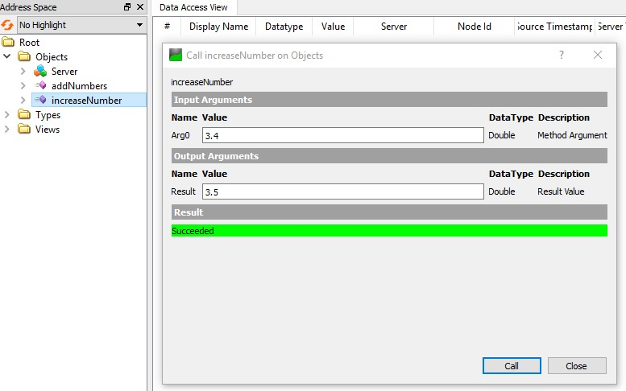
</p>

Using the *Lambda Capture* it is possible to change *Objects* or *Variables*:

```c++
auto varNumber = objsFolder->addBaseDataVariable();
varNumber->setDisplayName("Number");
varNumber->setValue(0.0);
varNumber->setDataType(QMetaType::Double);

objsFolder->addMethod("incrementNumberBy", [&varNumber](double increment) {
	double currentValue = varNumber->value().toDouble();
	double newValue = currentValue + increment;
	varNumber->setValue(newValue);
	return true;
});
```

<p align="center">
  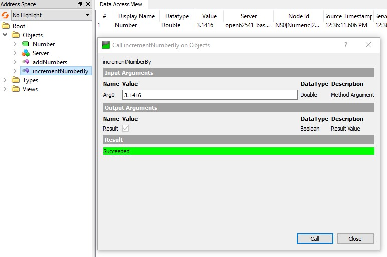
</p>

Using methods we can even **delete** *Objects* or *Variables*:

```c++
objsFolder->addMethod("deleteNumber", [&varNumber]() {
	if (!varNumber)
	{
		return;
	}
	delete varNumber;
	varNumber = nullptr;
});
```

<p align="center">
  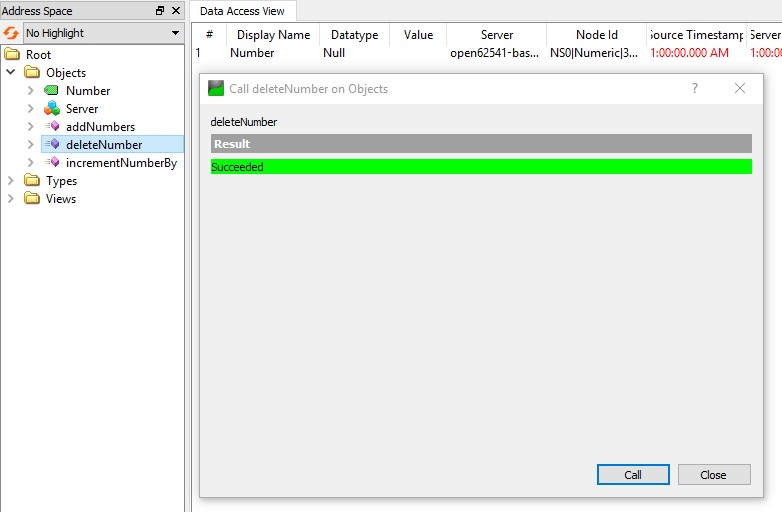
</p>

### Methods Example

Build and test the methods example in [./examples/02_methods](./examples/02_methods/main.cpp) to learn more.

---

## References

OPC UA supports the concept of *References* to create relations between *Nodes*. References are categorised in *HierarchicalReferences* and *NonHierarchicalReferences*. The *HierarchicalReferences* are the ones used by most OPC Clients to display the instances tree in their graphical user interfaces.

When adding an instance using the *QUaServer* API, the library creates the required *HierarchicalReference* type necessary to display the new instance in the instances tree (it uses the *HasComponent*, *HasProperty* or *Organizes* reference types accordingly).

The *QUaServer* API also allows to create **custom** *NonHierarchicalReferences* that can be used to create custom relations between instances. For example, having a temperature sensor and then define a supplier for that sensor:

```c++
// create sensor
QUaBaseObject * objSensor1 = objsFolder->addBaseObject();
objSensor1->setDisplayName("TempSensor1");
// create supplier
QUaBaseObject * objSupl1 = objsFolder->addBaseObject();
objSupl1->setDisplayName("Mouser");
// create reference
server.registerReference({ "Supplies", "IsSuppliedBy" });
objSupl1->addReference({ "Supplies", "IsSuppliedBy" }, objSensor1);
```

The `registerReference()` method has to be called in order to *register* the new references type as a *subtype* of the *NonHierarchicalReferences*. If the reference type is not registered before its first use, it is registered automatically on first use. The registered reference can be observed when the server is running by browsing to `/Root/Types/ReferenceTypes/NonHierarchicalReferences`. There should be a new entry corresponding to the custom reference.

<p align="center">
  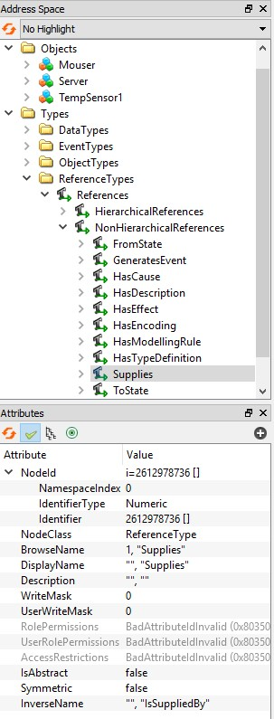
</p>

The references for the supplier object should list the *Supplies* reference:

<p align="center">
  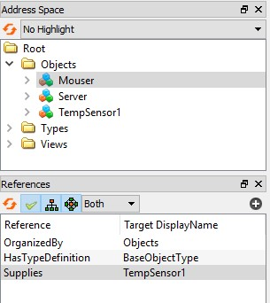
</p>

The references for the sensor object should list the *IsSuppliedBy* reference:

<p align="center">
  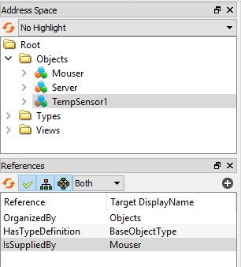
</p>

The `registerReference()` actually receives a `QUaReference` instance as an argument, which is defined as:

```c++
struct QUaReference
{
	QString strForwardName;
	QString strInverseName;
};
```

Both **forward** and **reverse** names of the reference have to be defined in order to create the reference. In the example, `Supplies` is the *forward* name, and `IsSuppliedBy` is the reverse name. When adding a reference, by default, it is added in *forward* mode. This can be changed by adding a third argument to the `addReference()` method which is `true` by default to indicate it is *forward*, `false` to indicate it is *reverse*. 

```c++
// objSupl1 "Supplies" objSensor1
objSupl1->addReference({ "Supplies", "IsSuppliedBy" }, objSensor1, true);
// objSensor2 "IsSuppliedBy" objSupl1
objSensor2->addReference({ "Supplies", "IsSuppliedBy" }, objSupl1, false);
```

In the example above, both sensors are supplied by the same supplier:

<p align="center">
  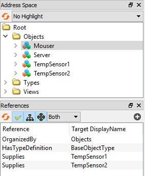
</p>

Programmatically, references can be added, removed and browsed using the following *QUaNode* API methods:

```c++
void addReference(const QUaReference &ref, const QUaNode * nodeTarget, const bool &isForward = true);

void removeReference(const QUaReference &ref, const QUaNode * nodeTarget, const bool &isForward = true);

template<typename T>
QList<T*>       findReferences(const QUaReference &ref, const bool &isForward = true);
// specialization
QList<QUaNode*> findReferences(const QUaReference &ref, const bool &isForward = true);
```

For example, to list all the sensors that are supplied by the supplier:

```c++
qDebug() << "Supplier" << objSupl1->displayName() << "supplies :";
auto listSensors = objSupl1->findReferences<QUaBaseObject>({ "Supplies", "IsSuppliedBy" });
for (int i = 0; i < listSensors.count(); i++)
{
	qDebug() << listSensors.at(i)->displayName();
}
```

And to list the supplier of a sensor:

```c++
qDebug() << objSensor1->displayName() << "supplier is: :";
auto listSuppliers = objSensor1->findReferences<QUaBaseObject>({ "Supplies", "IsSuppliedBy" }, false);
qDebug() << listSuppliers.first()->displayName();
```

Note that when an *QUaNode* derived instance is deleted, all its references are removed as well from all nodes in the address space.

### References Example

Build and test the methods example in [./examples/03_references](./examples/03_references/main.cpp) to learn more.

---

## Types

OPC types can be extended by subtyping *BaseObjects* or *BaseDataVariables* (*Properties* cannot be subtyped). Using the *QUaServer* library, a new *BaseObject* subtype can be created by deriving from `QUaBaseObject`. Similarly, a new *BaseDataVariable* subtype can be created by deriving from `QUaBaseDataVariable`.

Subtyping is very useful to **reuse** code. For example, if multiple temperature sensors are to be exposed through the OPC UA Server, it might be worth creating a type for it. Start by sub-classing `QUaBaseObject` as follows:

In `temperaturesensor.h` :

```c++
#include <QUaBaseObject>

class TemperatureSensor : public QUaBaseObject
{
	Q_OBJECT

public:
	Q_INVOKABLE explicit TemperatureSensor(QUaServer *server);
	
};
```

In `temperaturesensor.cpp` :

```c++
#include "temperaturesensor.h"

TemperatureSensor::TemperatureSensor(QUaServer *server)
	: QUaBaseObject(server)
{
	
}
```

There are 3 **important requirements** when creating subtypes:

* Inherit from either *QUaBaseObject* or *QUaBaseDataVariable* (which in turn inherit indirectly from *QObject*). The `Q_OBJECT` macro must be set.

* Create a public constructor that receives a `QUaServer` pointer as an argument. Add the `Q_INVOKABLE` macro to such constructor.

* In the constructor implementation call the parent constructor (*QUaBaseObject*, *QUaBaseDataVariable* or derived parent constructor accordingly).

Once all this is met, elsewhere in the code it is necessary to register the new type in the server using the `registerType<T>()` method. If not registered, then when creating an instance of the new type, the type will be registered automatically by the library.

An instance of the new type is created using the `addChild<T>()` method:

```c++
#include "temperaturesensor.h"

int main(int argc, char *argv[])
{
	QCoreApplication a(argc, argv);

	QUaServer server;

	QUaFolderObject * objsFolder = server.objectsFolder();

	// register new type
	server.registerType<TemperatureSensor>();

	// create new type instance
	auto sensor1 = objsFolder->addChild<TemperatureSensor>();
	sensor1->setDisplayName("Sensor1");

	server.start();

	return a.exec(); 
}
``` 

If the new type was registered correctly, it can be observed by browsing to `/Root/Types/ObjectTypes/BaseObjectType`. There should be a new entry corresponding to the custom type.

<p align="center">
  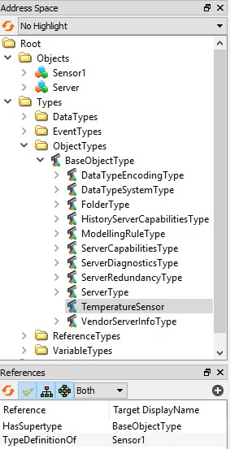
</p>

Note that the new *TemperatureSensor* type has a `TypeDefinitionOf` reference to the *Sensor1* instance. And the *Sensor1* instance has a `HasTypeDefinition` to the *TemperatureSensor* type.

Adding **child** *Variables*, *Properties* and potentially other *Objects* to the *TemperatureSensor* type is achieved through the [Qt Property System](https://doc.qt.io/qt-5/properties.html). 

Use the `Q_PROPERTY` macro to add pointers to types of desired children and the library will automatically instantiate the children once an specific instance of the *TemperatureSensor* type is created.

```c++
#include <QUaBaseObject>
#include <QUaBaseDataVariable>
#include <QUaProperty>

class TemperatureSensor : public QUaBaseObject
{
	Q_OBJECT
	// properties
	Q_PROPERTY(QUaProperty * model READ model)
	Q_PROPERTY(QUaProperty * brand READ brand)
	Q_PROPERTY(QUaProperty * units READ units)
	// variables
	Q_PROPERTY(QUaBaseDataVariable * status       READ status      )
	Q_PROPERTY(QUaBaseDataVariable * currentValue READ currentValue)
public:
	Q_INVOKABLE explicit TemperatureSensor(QUaServer *server);

	QUaProperty * model();
	QUaProperty * brand();
	QUaProperty * units();

	QUaBaseDataVariable * status      ();
	QUaBaseDataVariable * currentValue();
};
```

The *QUaServer* library automatically adds the C++ instances as [QObject children](https://doc.qt.io/qt-5/objecttrees.html) of the *TemperatureSensor* instance and assigns them the property name as their [QObject name](https://doc.qt.io/Qt-5/qobject.html#objectName-prop). Therefore it is possible retrieve the C++ children using the [`findChild` method](https://doc.qt.io/Qt-5/qobject.html#findChild).

```c++
TemperatureSensor::TemperatureSensor(QUaServer *server)
	: QUaBaseObject(server)
{
	// set defaults
	model()->setValue("TM35");
	brand()->setValue("Texas Instruments");
	units()->setValue("C");
	status()->setValue("Off");
	currentValue()->setValue(0.0);
	currentValue()->setDataType(QMetaType::Double);
}

QUaProperty * TemperatureSensor::model()
{
	return this->findChild<QUaProperty*>("model");
}

QUaProperty * TemperatureSensor::brand()
{
	return this->findChild<QUaProperty*>("brand");
}

QUaProperty * TemperatureSensor::units()
{
	return this->findChild<QUaProperty*>("units");
}

QUaBaseDataVariable * TemperatureSensor::status()
{
	return this->findChild<QUaBaseDataVariable*>("status");
}

QUaBaseDataVariable * TemperatureSensor::currentValue()
{
	return this->findChild<QUaBaseDataVariable*>("currentValue");
}
```

Be **careful** when using the [`findChild` method](https://doc.qt.io/Qt-5/qobject.html#findChild) to provide the correct [QObject name](https://doc.qt.io/Qt-5/qobject.html#objectName-prop), otherwise a null reference can be returned from any of the getter methods.

Note that in the *TemperatureSensor* constructor it is possible to already make use of the children instances and define some default values for them.

Now it is possible to create any number of *TemperatureSensor* instances and their children will be created and attached to them automatically.

```c++
auto sensor1 = objsFolder->addChild<TemperatureSensor>();
sensor1->setDisplayName("Sensor1");
auto sensor2 = objsFolder->addChild<TemperatureSensor>();
sensor2->setDisplayName("Sensor2");
auto sensor3 = objsFolder->addChild<TemperatureSensor>();
sensor3->setDisplayName("Sensor3");
```

<p align="center">
  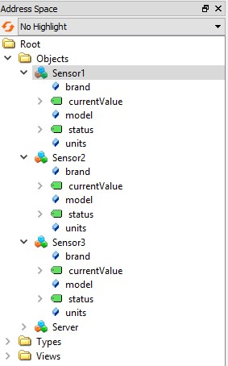
</p>

Any `Q_PROPERTY` added to the *TemperatureSensor* declaration that **inherits** `QUaProperty`, `QUaBaseDataVariable` or `QUaBaseObject` will be exposed through OPC UA. Else the `Q_PROPERTY` will be created in the C++ instance but not exposed through OPC UA.

To add **methods** to a subtype, the `Q_INVOKABLE` macro can be used. The limitations are than only [up to 10 arguments can used](https://doc.qt.io/qt-5/qmetamethod.html#invoke) and the argument types can only be the same supported by the `setDataType()` method (see the *Basics* section).

```c++
class TemperatureSensor : public QUaBaseObject
{
	Q_OBJECT
	
	// properties, variables, objects ...

public:
	Q_INVOKABLE explicit TemperatureSensor(QUaServer *server);

	// properties, variables, objects ...

	Q_INVOKABLE void turnOn();
	Q_INVOKABLE void turnOff();
};
```

The implementation is like a normal C++ class method:

```c++
void TemperatureSensor::turnOn()
{
	status()->setValue("On");
}

void TemperatureSensor::turnOff()
{
	status()->setValue("Off");
}
```

If the `Q_INVOKABLE` macro is not used, then the method is simply not exposed through OPC UA.

<p align="center">
  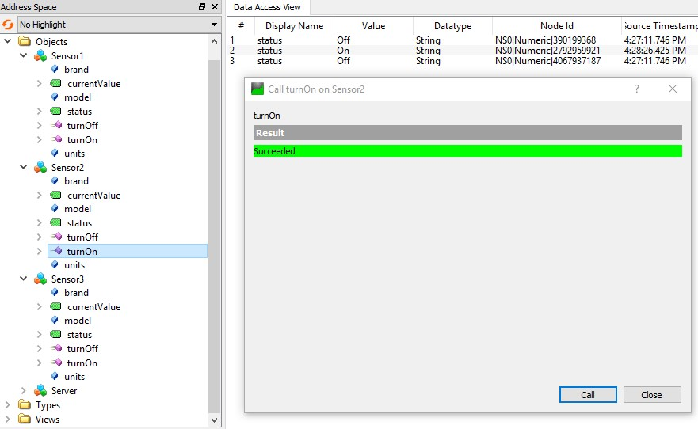
</p>

One final perk of creating subtypes is the possiblity of creating custom enumerators which can be used as data types for variables. This is done using the `Q_ENUM` macro:

```c++
class TemperatureSensor : public QUaBaseObject
{
	Q_OBJECT
	
	// properties, variables, objects ...

public:
	Q_INVOKABLE explicit TemperatureSensor(QUaServer *server);

	// properties, variables, objects ...
	// methods ...

	enum Units
	{
		C = 0,
		F = 1
	};
	Q_ENUM(Units)

};
```

Then using the enumerator to set the value of a *Variable*:

```c++
TemperatureSensor::TemperatureSensor(QUaServer *server)
	: QUaBaseObject(server)
{
	// set defaults ...
	// use enum as type
	units()->setDataTypeEnum(QMetaEnum::fromType<TemperatureSensor::Units>());
	units()->setValue(Units::C);
}
```

Then any client has knowledge of the enum options.

### Types Example

Build and test the methods example in [./examples/04_types](./examples/04_types/main.cpp) to learn more.

---

## Server

The `QUaServer` class constructor not only allows to set a custom port to run the server (see the *Basics* section), but also to set an SSL **certificate** so that clients can **validate** the server. The `QUaServer` instance also contains methods that allow to customise the server **description** published through OPC UA.

See the [validation document](./VALIDATION.md) for more details on how validation works.

### Create Certificates

Make sure `openssl` is installed and follow the next commands to create the certificate (on Windows use [MSys2](https://www.msys2.org/), on Linux just use the command line).

The first step is to create a Certificate Authority (CA). The CA will take the role of a system integrator comissioned with installing OPC Servers in a plant. The CA will have to:

* Create its own *public* and *private* key pair.

* Create its own **self-signed** *certificate*.

* Create its own *Certificate Revocation List (CRL)*.

Keys can be created and transformed into various formats. Ultimately, most OPCUA applications make use of the [DER format](https://wiki.openssl.org/index.php/DER). 

```bash
# Create directory to store CA's files
mkdir ca
# Create CA key
openssl genpkey -algorithm RSA -pkeyopt rsa_keygen_bits:2048 -out ca/ca.key
# Create self-signed CA cert
openssl req -new -x509 -days 3600 -key ca/ca.key -subj "/CN=juangburgos CA/O=juangburgos Organization" -out ca/ca.crt
# Convert cert to der format
openssl x509 -in ca/ca.crt -inform pem -out ca/ca.crt.der -outform der
# Create cert revocation list CRL file
# NOTE : might need to create in relative path
#        - File './demoCA/index.txt' (Empty)
#        - File './demoCA/crlnumber' with contents '1000'
openssl ca -keyfile ca/ca.key -cert ca/ca.crt -gencrl -out ca/ca.crl
# Convert CRL to der format
openssl crl -in ca/ca.crl -inform pem -out ca/ca.der.crl -outform der
```

The next steps must be applied for each server the system integrator wants to install.

* Create its own *public* and *private* key pair.

* Create an `exts.txt` which contain the *certificate extensions* required by the OPC UA standard.

* Create its own **unsigned** certificate, and with it a *certificate sign request*.

* Give the CA to sign its *certificate sign request*.

The `exts.txt` should be as follows:

```
[v3_ca]
subjectAltName=DNS:localhost,DNS:ppic09,IP:127.0.0.1,IP:192.168.1.18,URI:urn:unconfigured:application
basicConstraints=CA:TRUE
subjectKeyIdentifier=hash
authorityKeyIdentifier=keyid,issuer
keyUsage=digitalSignature,keyEncipherment
extendedKeyUsage=serverAuth,clientAuth,codeSigning
```

The `subjectAltName` must contains all the URLs that will be used to connect to the server. In the example above, clients might connect to the localhost (`127.0.0.1`) or through the Windows network, using the Windows PC name (`ppic09`), or through the local network (`192.168.1.18`).

```bash
# Create directory to store server's files
mkdir server
# Create server key
openssl genpkey -algorithm RSA -pkeyopt rsa_keygen_bits:2048 -out server/server.key
# Convert server key to der format
openssl rsa -in server/server.key -inform pem -out server/server.key.der -outform der
# Create server cert sign request
openssl req -new -sha256 \
-key server/server.key \
-subj "/C=ES/ST=MAD/O=MyServer/CN=localhost" \
-out server/server.csr
```

The CA must now sign the server's *certificate sign request* to create the *signed certificate*, appending also the required *certificate extensions* (`exts.txt`).

```bash
# Sign cert sign request (NOTE: must provide exts.txt)
openssl x509 -days 3600 -req \
-in server/server.csr \
-extensions v3_ca \
-extfile server/exts.txt \
-CAcreateserial -CA ca/ca.crt -CAkey ca/ca.key \
-out server/server.crt
# Convert cert to der format
openssl x509 -in server/server.crt -inform pem -out server/server.crt.der -outform der
```

### Use Certificates

First the CA's certificate and CRL must be copied to the client's software. 

In the case of *UA Expert*, in the user interface go to `Settings -> Manage Certificates...`. Then click the `Open Certificate Location`, which opens the file epxlorer to a location similar to:

```
$SOME_PATH/unifiedautomation/uaexpert/PKI/trusted/certs
```

The CA's certificate must be copied to this path:

```bash
cp ca/ca.crt.der $SOME_PATH/unifiedautomation/uaexpert/PKI/trusted/certs/ca.crt.der
```

Going one directory up, then in `crl` is where the CRL must be copied to:

```bash
cp ca/ca.der.crl $SOME_PATH/unifiedautomation/uaexpert/PKI/trusted/crl/ca.der.crl
```

Now the *server certificate* must be copied next to the *QUaServer* application:

```bash
cp server/server.key.der $SERVER_PATH/server.key.der
```

And in the C++ code the server's certificate contents need to be passed to the `QUaServer` constructor:

```c++
#include <QCoreApplication>
#include <QDebug>
#include <QFile>

#include <QUaServer>

int main(int argc, char *argv[])
{
	QCoreApplication a(argc, argv);

	// Load server certificate
	QFile certServer;
	certServer.setFileName("server.crt.der");
	Q_ASSERT(certServer.exists());
	certServer.open(QIODevice::ReadOnly);

	// Instantiate server by passing certificate contents
	QUaServer server(4840, certServer.readAll());

	server.start();

	return a.exec(); 
}
```

Now the client is able to validate the server before connecting to it.

Note that eventhough validation required creating and managing cryptographic keys, the communications are yet **not encrypted**. The files generated in this section are used in the *Encryption* to actually encrypt communications.

### Server Description

The `QUaServer` instance also contains methods to add custom server description:

```c++
// Add server description
server.setApplicationName ("my_app");
server.setApplicationUri  ("urn:juangburgos:my_app");
server.setProductName     ("my_product");
server.setProductUri      ("juangburgos.com");
server.setManufacturerName("My Company Inc.");
server.setSoftwareVersion ("6.6.6-master");
server.setBuildNumber     ("gvfsed43fs");
```

This information is then made available to the clients through the *Server Object* that can be found by browsing to `/Root/Objects/Server/ServerStatus/BuildInfo`

<p align="center">
  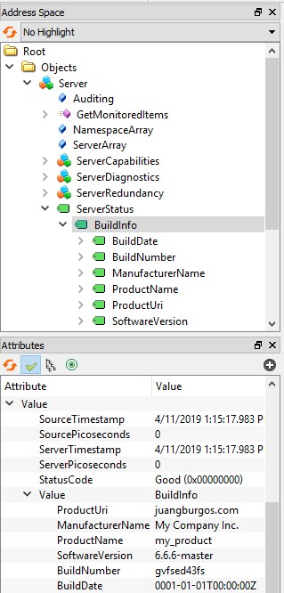
</p>

### Server Example

Build and test the server example in [./examples/05_server](./examples/05_server/main.cpp) to learn more.

Some test certificates are included for convenience in [./examples/05_server/ca_files](./examples/05_server/ca_files). **Do not use them in production**, just for testing purposes.

---

## Users

TODO.

---

## Encryption

TODO.

---

## Events

TODO.

---

## License

### Amalgamation

The amalgamation source code found in `./src/amalgamartion` is licensed by **open62541** under the [Mozilla Public License 2.0](https://github.com/open62541/open62541/blob/master/LICENSE).

### QUaTypesConverter

The source code in the files `./src/wrapper/quatypesconverter.h` and `quatypesconverter.cpp` was copied and adapted from the [QtOpcUa repository](https://github.com/qt/qtopcua) (files [qopen62541valueconverter.h](https://github.com/qt/qtopcua/blob/5.12/src/plugins/opcua/open62541/qopen62541valueconverter.h) and [qopen62541valueconverter.cpp](https://github.com/qt/qtopcua/blob/5.12/src/plugins/opcua/open62541/qopen62541valueconverter.cpp)) and is under the [LGPL license](https://github.com/qt/qtopcua/blob/5.12/LICENSE.LGPLv3).

### QUaServer

For the rest of the code, the license is [MIT]().

Copyright (c) 2019 Juan Gonzalez Burgos